# MomentMatcher - Architecture Diagrams

This document contains Mermaid diagrams visualizing the MomentMatcher system architecture.

## System Architecture Overview

## Video Upload and Analysis Flow

## Database Schema Relationships

## Ad Spot Quality Calculation Flow

## Component Interaction Diagram

## Deployment Architecture (Vercel)

## Data Flow for Timeline Visualization

## API Rate Limiting Strategy

## Spot Quality Scoring Algorithm

```mermaid
graph TD
    A[Input: Context + Emotion + Confidence] --> B[Detect Categories]

    B --> C{Category Match?}
    C -->|Finance| D1[CPM: $20-40]
    C -->|Tech| D2[CPM: $10-22]
    C -->|Sports| D3[CPM: $10-18]
    C -->|Other| D4[CPM: $7-14]

    A --> E{Emotional Tone}
    E -->|Excited/Passionate| F1[Intensity: 90]
    E -->|Happy/Positive| F2[Intensity: 70]
    E -->|Neutral/Calm| F3[Intensity: 50]

    A --> G[Confidence Score]

    F1 & F2 & F3 --> H[Emotion Intensity]
    G --> I[Confidence Value]

    H --> J[Engagement = Emotion×0.6 + Confidence×0.4]
    I --> J

    I --> K[Attention = Confidence×0.7 + Emotion×0.3]
    H --> K

    J --> L[Engagement Score]
    K --> M[Attention Score]

    L --> N{Avg Score}
    M --> N

    N -->|≥80| O[Premium: 1.3×]
    N -->|60-79| P[Standard: 1.0×]
    N -->|<60| Q[Basic: 0.7×]

    D1 & D2 & D3 & D4 --> R[Base CPM]
    O & P & Q --> S[Multiplier]

    R --> T[Final CPM = Base × Multiplier]
    S --> T

    style O fill:#FFD700
    style P fill:#4A90E2
    style Q fill:#808080
```

---

## How to Use These Diagrams

### Viewing in GitHub/GitLab

These Mermaid diagrams will render automatically in GitHub and GitLab markdown viewers.

### Viewing Locally

1. Use a Mermaid-compatible markdown viewer:
   - VS Code: Install "Markdown Preview Mermaid Support" extension
   - Browser: Use Mermaid Live Editor (https://mermaid.live)
   - Documentation tools: MkDocs, Docusaurus, etc.

### Exporting to Images

Visit https://mermaid.live and paste any diagram to export as PNG/SVG.

### Editing

Use the Mermaid syntax to modify diagrams. Documentation: https://mermaid.js.org/

---

## Diagram Legend

### Colors

- 🔵 **Blue** - User-facing components, standard tier
- 🟢 **Green** - External services, AI components, success states
- 🔴 **Red** - Database, data persistence
- 🟡 **Gold** - Premium tier, CDN, high-value components
- ⚫ **Gray** - Basic tier, low-priority components

### Symbols

- **Rectangle** - Process, component, service
- **Diamond** - Decision point, conditional logic
- **Cylinder** - Database, data storage
- **Cloud** - External service, API
- **Arrow** - Data flow, dependency
- **Dashed Line** - Indirect relationship, CDN delivery
