# Diagram Generation Summary

Successfully generated architecture diagrams from Mermaid code!

## ✅ What Was Generated

### 9 Architecture Diagrams

Each diagram is available in two formats:

| # | Diagram Name | PNG | SVG | Description |
|---|-------------|-----|-----|-------------|
| 1 | System Architecture Overview | 108KB | 53KB | Complete system layers and components |
| 2 | Video Upload & Analysis Flow | 204KB | 35KB | Sequence diagram of full video processing |
| 3 | Database Schema | 199KB | 164KB | Entity-relationship diagram (ERD) |
| 4 | Ad Spot Quality Calculation | 157KB | 55KB | Flowchart of quality scoring algorithm |
| 5 | Component Interaction | 98KB | 35KB | Frontend/backend component connections |
| 6 | Deployment Architecture | 65KB | 24KB | Vercel production deployment topology |
| 7 | Timeline Visualization | 57KB | 27KB | Data flow for timeline rendering |
| 8 | API Rate Limiting | 82KB | 29KB | Rate limiting strategy flowchart |
| 9 | Spot Quality Scoring | 152KB | 51KB | Detailed CPM calculation algorithm |

**Total**: 18 files (9 PNG + 9 SVG) = ~1.2MB

## 📁 Directory Structure

```
momentmatcher/
├── diagrams/
│   ├── README.md                          # Diagram documentation
│   ├── 01-system-architecture.png         # PNG format
│   ├── 01-system-architecture.svg         # SVG format
│   ├── 02-video-analysis-flow.png
│   ├── 02-video-analysis-flow.svg
│   ├── 03-database-schema.png
│   ├── 03-database-schema.svg
│   ├── 04-spot-quality-calculation.png
│   ├── 04-spot-quality-calculation.svg
│   ├── 05-component-interaction.png
│   ├── 05-component-interaction.svg
│   ├── 06-deployment-architecture.png
│   ├── 06-deployment-architecture.svg
│   ├── 07-timeline-visualization.png
│   ├── 07-timeline-visualization.svg
│   ├── 08-rate-limiting.png
│   ├── 08-rate-limiting.svg
│   ├── 09-spot-quality-scoring.png
│   ├── 09-spot-quality-scoring.svg
│   └── source/
│       ├── 01-system-architecture.mmd     # Source Mermaid files
│       ├── 02-video-analysis-flow.mmd
│       ├── 03-database-schema.mmd
│       ├── 04-spot-quality-calculation.mmd
│       ├── 05-component-interaction.mmd
│       ├── 06-deployment-architecture.mmd
│       ├── 07-timeline-visualization.mmd
│       ├── 08-rate-limiting.mmd
│       └── 09-spot-quality-scoring.mmd
├── scripts/
│   └── generate-diagrams.sh               # Generation script
└── ARCHITECTURE_DIAGRAM.md                # Original with Mermaid code
```

## 🎨 Image Specifications

### PNG Files
- **Resolution**: 1920x1080 pixels
- **Background**: Transparent
- **Format**: PNG with alpha channel
- **Use case**: Presentations, documents, general use

### SVG Files
- **Type**: Scalable vector graphics
- **Background**: Transparent
- **Scalability**: Infinite resolution
- **Use case**: Web, printing, high-quality scaling

## 🚀 Usage

### Command Line
```bash
# Generate all diagrams
npm run generate-diagrams

# Or directly
./scripts/generate-diagrams.sh
```

### In Markdown
```markdown

```

### In HTML
```html

```

### In Presentations
- Drag and drop PNG files into PowerPoint, Keynote, Google Slides
- Transparent background adapts to any slide background

## 🔧 Regeneration

To regenerate diagrams after editing the Mermaid code:

1. **Edit source**: Modify Mermaid code in `ARCHITECTURE_DIAGRAM.md`
2. **Update script**: The script in `scripts/generate-diagrams.sh` extracts from comments
3. **Regenerate**: Run `npm run generate-diagrams`

**Note**: The script currently has hardcoded Mermaid definitions. To regenerate from the markdown file, you would need to modify the script to parse `ARCHITECTURE_DIAGRAM.md` directly.

## 📊 Technical Details

### Tools Used
- **Mermaid CLI** (`@mermaid-js/mermaid-cli`)
- Command: `mmdc` (Mermaid Diagram Creator)
- Installation: `npm install -g @mermaid-js/mermaid-cli`

### Generation Parameters
```bash
# PNG generation
mmdc -i input.mmd \
     -o output.png \
     -b transparent \      # Transparent background
     -w 1920 \            # Width
     -H 1080              # Height

# SVG generation
mmdc -i input.mmd \
     -o output.svg \
     -b transparent       # Transparent background
```

## 🎯 Benefits

### For Documentation
✅ Professional-looking diagrams  
✅ Consistent styling across all visuals  
✅ Easy to embed in any format  
✅ Version-controlled diagram source code  

### For Presentations
✅ High resolution for projectors  
✅ Transparent backgrounds blend with any slide  
✅ SVG for infinite zoom without quality loss  

### For Web
✅ Optimized file sizes  
✅ SVG loads fast and scales perfectly  
✅ Looks great on any device/resolution  

### For Maintenance
✅ Source code in version control  
✅ One command to regenerate all  
✅ Easy to update and iterate  
✅ No design tool licenses needed  

## 📚 Related Files

- **[diagrams/README.md](./diagrams/README.md)** - Detailed diagram documentation
- **[ARCHITECTURE_DIAGRAM.md](./ARCHITECTURE_DIAGRAM.md)** - Mermaid source with GitHub rendering
- **[TECHNICAL_ARCHITECTURE.md](./TECHNICAL_ARCHITECTURE.md)** - Technical documentation
- **[scripts/generate-diagrams.sh](./scripts/generate-diagrams.sh)** - Generation script

## 🔄 Workflow

```
Edit Mermaid Code in ARCHITECTURE_DIAGRAM.md
              ↓
Run: npm run generate-diagrams
              ↓
Extract Mermaid blocks → .mmd files
              ↓
Generate PNG (mmdc -o .png)
              ↓
Generate SVG (mmdc -o .svg)
              ↓
Save to diagrams/ folder
              ↓
✅ Ready to use!
```

## 💡 Tips

1. **PNG for most uses**: Good quality, universal support
2. **SVG for web**: Better file size, infinite scaling
3. **Keep source files**: The `.mmd` files in `diagrams/source/`
4. **Version control**: Commit both source and generated files
5. **Regenerate regularly**: After any architecture changes

## ✨ Future Enhancements

Potential improvements to consider:

- [ ] Automatic parsing from ARCHITECTURE_DIAGRAM.md
- [ ] Different color themes (light/dark mode)
- [ ] Multiple resolution options for PNG
- [ ] PDF generation for printable docs
- [ ] Thumbnail generation for quick preview
- [ ] CI/CD integration for auto-generation
- [ ] Interactive HTML diagrams with clickable elements

---

**Generated**: 2025-01-06  
**Tool**: Mermaid CLI v10.x  
**Status**: ✅ All diagrams successfully generated  
**Total Size**: ~1.2MB for all formats

